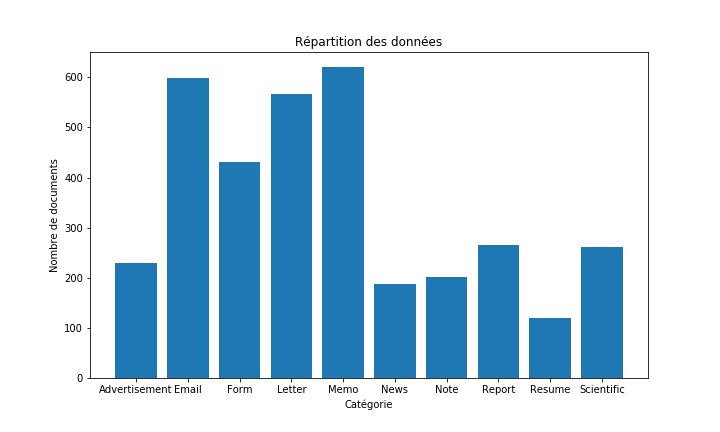
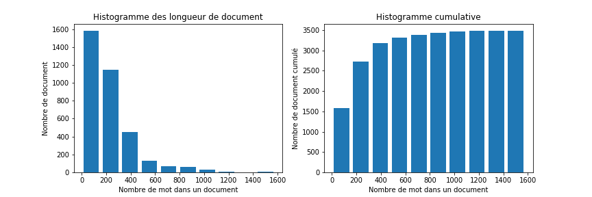
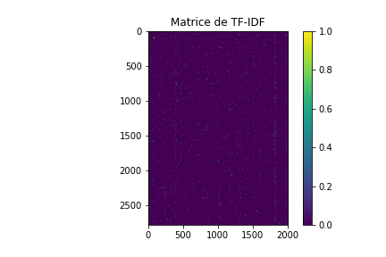
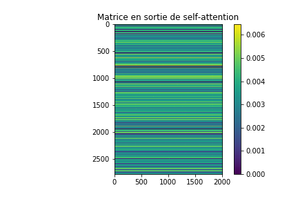
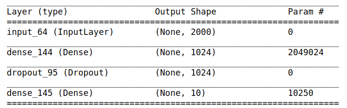

# Classification des documents du procès des groupes américains du tabac

### _Jitao XU 24/12/2018_

## 1. Introduction

Le gouvernement américain a attaqué en justice cinq grands groupes américains du tabac pour avoir amassé d'importants bénéfices en mentant sur les dangers de la cigarette. Le cigarettiers  se sont entendus dès 1953, pour "mener ensemble une vaste campagne de relations publiques afin de contrer les preuves de plus en plus manifestes d'un lien entre la consommation de tabac et des maladies graves".

Dans ce procès 14 millions de documents ont été collectés et numérisés. Afin de faciliter l'exploitation de ces documents par les avocats, nous allons mettre en place une classification automatique des types de documents.

## 2. Analyse des Données

Les données originaux sont des images de documents numérisés, répartis dans 10 catégories suivantes :

* Advertisement 

* Email 

* Form 

* Letter 

* Memo 

* Opening News 

* Note 

* Report 

* Resume 

* Scientific 

### 2.1 Nombre de documents par catégorie

Dans ce TP, les données que nous avons utilisé sont un échantillon aléatoire des documents, qui contiennent 3482 documents répartis dans les catégories dessus. Ces données sont des textes contenu dans les documents obtenu par OCR. Voici la répatition des documents.

Nous pouvons voir que les données sont déséquilibres. Les classes Email, Form, Letter et Memo sont sur-représentés par rapport aux autres classes. Dans ce cas là, il ne faudra pas utiliser directement la précision pour évaluer la performance du modèle. Afin de mieux évaluer les modèle, nous allons utiliser F1-score comme métric et la matrice de confusion pour visualiser la performance.

### 2.2 Longueur de documents

Nous avons effectué aussi une statistique sur la longueur de chaque document, c'est-à-dire le nombre de mots dans chaque document.

Nous pouvons constater que la plupart des documents ont une longueur inférieure que 500 mots. Cette statistique nous permet de couper les document plus long que 500 mots pour avoir une taille de document fixe quand nous entraînons les réseaux de neurones.

### 2.3 Qualité des données

 Vu que les données sont obtenu par OCR, il existe la forte chance que la reconnaissance contient des erreurs. Nous avons listé quelques phrases contenant des erreurs :
 
 * "Baely doesn’) keow bea te Bitton Aau-Fotne bl resin syste. "
 
 * "I have received your letter of April 22 and the forms for epplication for & research grant."

Les erreurs nous ont limités d'utiliser des vecteurs de mots externes. Nous ne pouvons qu'essayer d'entraîner les vecteurs de mots à partir de nos données. Vu que les mots dans les documents ne sont pas exactement des vrais mots et il peut contenir différentes erreurs qui n'apparaît que très  peu de fois, nous ne pouvons pas non plus garantir la qualité des vecteurs de mots entraîné.

## 3. Analyse du problème et présentation de la solution

Tout d'abord, nous devons séparer notre jeu de données dans trois parties: les données d'apprentissage, les données de validation et les données de test. Ils contiennent 60%, 20% et 20% respectivement de données globale. Les données de test sont conservées que pour le test final. Les données de validation sont utilisés pour régler les hyperparamtères et les données d'apprentissage sont pour l'entraînement. Dans le cas réel, La séparation d'apprentissage et de validation peut être réalisée dans l'entraînement du modèle. 

Le but de base est la classification des documents, qui peut être séparée dans deux sous parties : 

* Représentation des documents

* Classification en utilisant la représentation.

### 3.1 Représentation des documents

Nous pouvons trouver deux dypes de représentation : TF-IDF et l'utilisation des vecteurs de mots.

#### 3.1.1 TF-IDF

Nous pouvons construire la matrice de TF-IDF à partir de données d'apprentissage. Chaque document est représenté par un vecteur de taille de nombre de mot pris en compte. Nous avons choisi un nombre de mots 2000, dans ce cas là, chaque document est représenté par un vecteur de taille 2000. 

#### 3.1.2 Vecteur de mots

Nous pouvons aussi transférer chaque mots dans un document à un vecteur de mots. Ensuite, nous conservons une taille maximale de documents. Nous construisons une matrice pour chaque document en conservant l'ordre de mots dans le document. Nous avons choisi une taille maximale de 500 comme mentionné dessus et nous avons entraîné les vecteurs de mot de taille 100. Nous obtenons donc une matrice de 500 * 100 pour chaque document.

Nous avons utilisé FastText Skipgram pour entraîner les vecteurs de mots parce que les expériences ont montré qu'il est le modèle le plus efficace et performant.

### 3.2 Proposition des modèles

#### 3.2.1 FastText

FastText est un modèle qui peut servir à classifier les document directement et aussi entraîner les vecteurs de mots. Nous avons utilisé le classifieur de FastText dans un premier temps pour construire un modèle. Nous avons choisi FastText parce qu'il existe un librairie qui peut nous aider à obtenir notre modèle avec très peu de code et l'entraînement du modèle est tellement rapide.

#### 3.2.2 CNN-LSTM

Nous avons construit un modèle avec des couches convolutionnel d'une dimension et LSTM comme un classifeur, celui là utilise les matrice de vecteurs de mots comme entrées. Nous n'avons pas essayer vecteur TF-IDF comme entrées parce que CNN peut extraire des informations de lien entre les elements et LSTM peut trèse bien traiter les information dans une séquence. Cependant, TF-IDF représentation ne contient pas ces types d'information. Les informations sont plutôt des mots indépendants, autrement dit, il n'existe pas d'information de contexte dans TF-IDF. En conséquence, l'utilisation de TF-IDF n'est pas une idée logique avec CNN-LSTM.

#### 3.2.3 CNN

Vu que le modèle CNN-LSTM est assez compliqué mais nous ne possédons très peu de données, nos données ne peuvent être pas assez compliqué pour entraîner le modèle CNN-LSTM. Dans ce cas là, nous avons aussi proposé d'utiliser un modèle avec que du CNN. Les expériences ont montré que CNN est très performant pour la classification du texte.

#### 3.2.4 TF-IDF-NN

Les modèle ci-dessus n'utilisent pas la représentation TF-IDF parce que les architectures des modèles ne sont pas adaptatives avec TF-IDF. Cependant, nous pouvons utiliser un réseau de neurones simple pour appliquer TF-IDF. Vu que la représentation TF-IDF est relativement moins compliqué que la représentation de vecteurs de mot, ce modèle a la chance d'avoir des bons résultat.

#### 3.2.5 Self-Attention NN

[Transformer](https://arxiv.org/abs/1706.03762) est un modèle très performant qui utilise le mécanisme d'attention. Le coeur du modèle est le méchanisme de self-attention, qui est calculé par : 

$Attention(Q, K, V) = softmax(\frac{QK^T}{\sqrt{d_k}})V$

Nous avons construit un modèle avec une couche de self-attention et des couches de dense pour réaliser l'idée simple de Transformer. Vu que la couche de self-attention ne contient pas de paramètre entraînable et nous n'avons pas réaliser multi-head self-attention, nous pouvons aussi ajouter une deuxième couche de self attention dans notre modèle.

Ce modèle est appliquable aux représentation TF-IDF et aussi vecteurs de mots. Le principe est de calculer le produit scalaire entre chaque position donc n'importe quel type de représentation peut être logiquement utilisée.

Nous allons nomer ce modèle avec TF-IDF et vecteur de mot comme TF-Attention et WV-Attention, respectivement.

## 4.  Analyse des performances et choix final

### 4.1 FastText

Le résultat obtenu par modèle FastText nous a donné un F1-score de 78.19%. Nous pouvons considérer ce résultat comme un critère de base. 

### 4.2 CNN-LSTM

Le modèle CNN-LSTM a obtenu un F1-score de 80.05%. Nous pouvons voir que ce modèle a eu une amélioration évident, qui a montrés que notre proposition est correcte.

Cependant, l'entraînement a montré aussi que le modèle a eu une très forte sur-apprentissage. Concernant le nombre de données, la sur-apprentissage est normale parce que le modèle est performant et il peut apprendre facilement les caractéristiques des données d'apprentissage.

Un autre point important, l'entraînement de ce modèle a pris beaucoup plus de temps que tout les autres modèles parce que l'LSTM ne peut pas être parallèle à cause d'algorithm de Backpropagation Through Time.

### 4.3 CNN

Le modèle pure CNN a obtenu un F1-score de 77.33%. Ce résultat est moins bien que FastText. Ce modèle rencontre le même problème de sur apprentissage que celui d'avant.

### 4.4 TF-IDF-NN

Ce modèle a eu 80.77% comme F1-score, qui est le meilleur résultat que nous pouvons obtenu. Ce modèle n'est assez compliqué que les autres parce l'entrée est relativement simple. La sur apprentissage n'est moins évident que les autres modèles, mais elle existe quand même. 

### 4.5 TF-Attention

Le modèle TF-Attention a eu le résultat de 21.09%. Ce résultat n'est pas du tout raisonable. En constatant l'entraînement, nous avons trouvé que ce modèle n'arrivait pas à converger. Le loss restait au très haute niveau. Nous avons effectué un self-attention manuellement pour analyser ce problème.

En calculant le résultat de self-attention et affichant la matrice d'attention, nous avons trouver que la matrice d'attention a des valeurs très petites. C'est parce que le vecteur de TF-IDF est très sparse dans nos données, donc il existe beaucoup de 0 dans le vecteur. En calculant le produit entre chaque position du vecteur et tout les autres postion, nous obtenons encore plus de zero dans la matrice d'attention. La sortie de self-attention nous a donné des valeurs très proche pour chaque vecteur du document. C'est à dire un vecteur de taille 2000 peut être considéré comme une seule valeur parce que il n'existe pas de différence entre chaque position de vecteur. Dans ce cas là, nous avons perdu beaucoup d'information du document et donc le modèle ne pouvait pas converger. Voici la matrice de de TF-IDF et celle en sortie de self-attention.

### 4.6 WV-Attention

Le résultat de WV-Attention est 72.59%. Ce modèle subit aussi forte sur-apprentissage. Nous avons essayé d'augmenter le degree de régularisation mais nous ne ponvions pas obtenu des bonne résultat. Cependant, le modèle peut arriver à une haute performance sur les données d'apprentissage avec très peu d'entraînement. Si nous avons plus de données, ce modèle aura la chance d'être performant.

### 4.7 Choix final

Après avoir comparer les résultat des modèles ci-dessus, nous avons décidé d'utiliser TF-IDF-NN comme la solution finale. Non seulement parce que il est le plus performant, mais aussi parce que le temps de calcul pour ce modèle est plus rapide que la plupart des autres modèles. Ce modèle contient une seule couche caché avec 1024 d'unités. Nous avons utilisé la probabilité 0.8 pour Dropout afin de diminuer sur-apprentissage. Voici un bilan du modèle : 

Considérant la forte aléatoirété, les résultat peuvent varier entre une borne d'environs 3-4% de F1-score. Dans ce cas là, la différence entre tout les modèles sauf TF-Attention est assez faible. Nous ne pouvons pas déterminer un modèle qui est sûr d'être plus performant que d'autres. Celon nos expérimentations, CNN-LSTM est peut-être un peu mieux que les autres de 1% de F1-score, mais le temps de calcul est beaucoup plus long que les autres.

## 5. Améliorations

Nous avons essayé plusieurs modèle possibles. Un point commun des modèles est la forte sur-apprentissage. Vu que nous avons seulement 3482 documents en totale et environs 2500 pour l'entraînement, sur-apprentissage est inévitable avec les réseaux de neurones. 

La première chose que nous pouvons faire est de construire plus de données textes à partir des images de document en utilisant l'OCR. Vu que nous avons déjà tous les images et la techinque OCR, l'obtention de plus de données ne doit pas être très difficile.

Si nous nous restons de le cadre des 3482 documents, nous pouvons aussi essayer avec SVM ou Forêt Aléatoire. Ces deux méthodes sont aussi très performant et moins compliqué que les réseaux de neurones.

Nous pouvons aussi commencer directement depuis les images originaux. Cette fois-ci nous possédons assez de donées. Nous pouvons utiliser Deep CNN sur les images pour extraire des information et ensuite concaténer LSTM ou Transformer pour classifier les données. Cependant, les images ne sont pas de la même taille, qui peut être compliqué pour construire les modèle. Il existe FCNN qui peut être utile.

